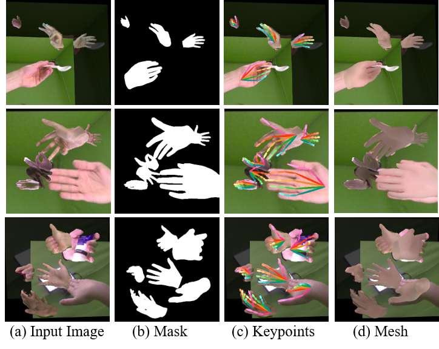

# SMHR: Single-stage Multiple Hand Reconstruction with weak supervision

## Introduction
* This repo is official **[PyTorch](https://pytorch.org)** implementation of **[End-to-end Weakly-supervised Multiple 3D Hand Mesh Reconstruction from Single Image](https://arxiv.org/abs/2204.08154)**. 

### Overview of the proposed framework
<p align="middle">
    
</p>

## Install
*   Environment
```
    conda create -n SMHR python=3.7
    conda activate SMHR

    # If you failed to install pytorch, you may try to modify your conda source: https://mirrors.tuna.tsinghua.edu.cn/help/anaconda/
    conda install -c pytorch pytorch==1.6.0 torchvision cudatoolkit=10.1
    
    # install pytorch3d from source if you are not using latest pytorch version
    conda install -c fvcore -c iopath -c conda-forge fvcore iopath
    conda install -c bottler nvidiacub
    conda install pytorch3d -c pytorch3d

    pip install -r requirements.txt    
```

## Directory

### Root
The `${ROOT}` is described as below.
```
${ROOT}
|-- data
|-- lib
|-- outputs
|-- scripts
|-- assets
```
* `data` contains packaged dataset loaders and soft links to the datasets' image and annotation directories.
* `lib` contains main codes for SMHR, including dataset loader code, network model, training code and other utils files.
* `scripts` contains running scripts.
* `outputs` contains log, trained models, imgs, and pretrained models for model outputs.
* `assets` contains demo images.

### Data
You need to follow directory structure of the `data` as below. (recommend to use soft links to access the datasets)
```
${ROOT}
|-- data
|   |-- FreiHAND
|   |   |-- evaluation
|   |   |-- training
|   |   |***.json
|   |-- HO3D
|   |   |-- evaluation
|   |   |-- train
|   |   |***.txt
|   |-- MultiHand
|   |***.pth 
|   |***.pkl
|   |joint_dataset.txt
```
* Download the FreiHAND dataset from the [[website](https://lmb.informatik.uni-freiburg.de/resources/datasets/FreihandDataset.en.html)]
* Download the HO3D dataset from the [[website](https://www.tugraz.at/index.php?id=40231)]
* Download pre-trained models and dataset loaders here [[cloud](https://pan.baidu.com/s/1ybGwa7CRAQOWo5IwnV-t9A)] (Extraction code: krg9) and put them in the `data` folder.
 


## Demo on single/multiple hand images
### Single Hand dataset(FreiHAND)
*  Modify `scripts/demo.sh` to Single-FreiHAND setting. 
    task = 'simplified',dataset='FreiHAND',Input_RES=224,CHECKPOINTS_PATH='${ROOT}/data/FreiHAND-2d-simplified.pth', comment out #L30 '--pick_hand'
*  Modify `demo.py` to use images from FreiHAND dataset. 
    #L80:   base_dir = 'assets/Single/FreiHAND'
*  run ` bash scripts/demo.sh`
*  You can see rendered outputs in `outputs/FreiHAND/`.
### Single Hand dataset(HO3D)
*  Modify `scripts/demo.sh` to Single-HO3D setting. 
    task = 'simplified',dataset='HO3D',Input_RES=224,CHECKPOINTS_PATH='${ROOT}/data/HO3D-2d-simplified.pth', comment out #L30 '--pick_hand'
*  Modify `demo.py` to use images from HO3D dataset. 
    #L80:   base_dir = 'assets/Single/HO3D'
*  run ` bash scripts/demo.sh`
*  You can see rendered outputs in `outputs/HO3D/`.
### Multiple Hand (Joint dataset)
*  Modify `scripts/demo.sh` to Multi-hand setting. 
    task = 'artificial',dataset='Joint',Input_RES=384,CHECKPOINTS_PATH='${ROOT}/data/FreiHAND-2d-artificial.pth', uncomment #L30 '--pick_hand'
*  Modify `demo.py` to use multi-hand images. 
    #L80: base_dir = 'assets/Multi'
*  run ` bash scripts/demo.sh`
*  You can see rendered outputs in `outputs/Multi/`.


### Training and Evaluation
    Coming Soon...


### Outputs of Single Hand images
<p align="middle">
    
    
</p>

### Outputs of Multiple Hand images
<p align="middle">
    
</p>

## Citation
If you find our work useful in your research, please consider citing:
```
@article{Ren2022EndtoendWM,
  title={End-to-end Weakly-supervised Multiple 3D Hand Mesh Reconstruction from Single Image},
  author={Jinwei Ren and Jianke Zhu and Jialiang Zhang},
  journal={ArXiv},
  year={2022},
  volume={abs/2204.08154}
}
```
